

Cosmos DB real-time advanced analytics

Before the hands-on lab setup guide

September 2021

Information in this document, including URL and other Internet Web site references, is subject to change without notice. Unless otherwise noted, the example companies, organizations, products, domain names, e-mail addresses, logos, people, places, and events depicted herein are fictitious, and no association with any real company, organization, product, domain name, e-mail address, logo, person, place or event is intended or should be inferred. Complying with all applicable copyright laws is the responsibility of the user. Without limiting the rights under copyright, no part of this document may be reproduced, stored in or introduced into a retrieval system, or transmitted in any form or by any means (electronic, mechanical, photocopying, recording, or otherwise), or for any purpose, without the express written permission of Microsoft Corporation.

Microsoft may have patents, patent applications, trademarks, copyrights, or other intellectual property rights covering subject matter in this document. Except as expressly provided in any written license agreement from Microsoft, the furnishing of this document does not give you any license to these patents, trademarks, copyrights, or other intellectual property.

The names of manufacturers, products, or URLs are provided for informational purposes only and Microsoft makes no representations and warranties, either expressed, implied, or statutory, regarding these manufacturers or the use of the products with any Microsoft technologies. The inclusion of a manufacturer or product does not imply endorsement of Microsoft of the manufacturer or product. Links may be provided to third party sites. Such sites are not under the control of Microsoft and Microsoft is not responsible for the contents of any linked site or any link contained in a linked site, or any changes or updates to such sites. Microsoft is not responsible for webcasting or any other form of transmission received from any linked site. Microsoft is providing these links to you only as a convenience, and the inclusion of any link does not imply endorsement of Microsoft of the site or the products contained therein.

© 2021 Microsoft Corporation. All rights reserved.

Microsoft and the trademarks listed at <https://www.microsoft.com/en-us/legal/intellectualproperty/Trademarks/Usage/General.aspx> are trademarks of the Microsoft group of companies. All other trademarks are property of their respective owners.

**Contents**

<!-- TOC -->

- [Cosmos DB real-time advanced analytics before the hands-on lab setup guide](#cosmos-db-real-time-advanced-analytics-before-the-hands-on-lab-setup-guide)
  - [Requirements](#requirements)
  - [Before the hands-on lab](#before-the-hands-on-lab)
    - [Task 1: Provision a resource group](#task-1-provision-a-resource-group)
    - [Task 2: Deploy Environment](#task-2-deploy-environment)
    - [Task 3: Set the default web browser to Microsoft Edge on the Lab VM](#task-3-set-the-default-web-browser-to-microsoft-edge-on-the-lab-vm)
    - [Task 4: Download and install Power BI Desktop](#task-4-download-and-install-power-bi-desktop)

<!-- /TOC -->

# Cosmos DB real-time advanced analytics before the hands-on lab setup guide

## Requirements

1. Microsoft Azure subscription (non-Microsoft subscription, must be a pay-as-you-go subscription).
2. **IMPORTANT**: To complete the OAuth 2.0 access components of this hands-on lab you must have permissions within your Azure subscription to create an App Registration and service principal within Azure Active Directory.

## Before the hands-on lab

Duration: 60 minutes

In the Before the hands-on lab exercise, you will set up your environment for use in the rest of the hands-on lab. You should follow all the steps provided in the Before the hands-on lab section to prepare your environment **before attending** the hands-on lab. Failure to do so will significantly impact your ability to complete the lab within the time allowed.

> **Important**: Most Azure resources require unique names. Throughout this lab you will see the word “SUFFIX” as part of resource names. You should replace this with your Microsoft alias, initials, or another value to ensure the resource is uniquely named.

### Task 1: Provision a resource group

In this task, you will create an Azure resource group for the resources used throughout this lab.

In this task, you create an Azure resource group to serve as a container for the resources used throughout this lab.

1. In the [Azure portal](https://portal.azure.com), select **Resource groups** from the Azure services list.

   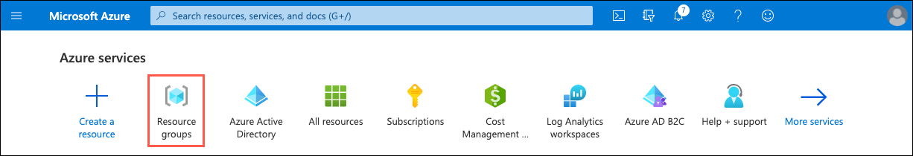

2. On the Resource groups blade, select **+Create**.

   

3. On the Create a resource group **Basics** tab, enter the following:

   - **Subscription (1)**: Select the subscription you are using for this hands-on lab.
   - **Resource group (2)**: Enter **hands-on-lab-SUFFIX** as the name of the new resource group.
   - **Region (3)**: Select the region you are using for this hands-on lab.

   

4. Select **Review + Create (4)**.

5. On the **Review + create** tab, ensure the Validation passed message is displayed and then select **Create**.

### Task 2: Deploy Environment

1. Deploy the workspace through the following Azure ARM template (press the button below):

    

2. Enter the following values, then select **Review + create**:

   - Resource group: **Select the Resource Group created previously for the lab**.
   - Unique Suffix: **Enter a unique value, such as your initials followed by birth year**.
   - Autoscale Max Throughput: **Enter 4000 as the max RU/s for the Azure Cosmos DB containers**.
   - Vm Username: **Accept the default value, `demouser`**.
   - Vm Password: **Accept the default value, `Password.1!!` (or change to a different one)**.

   

3. Select **Create** on the `Review + create` form.

    

4. The deployment will take approximately 15 - 20 minutes to complete.

    

### Task 3: Set the default web browser to Microsoft Edge on the Lab VM

In this task, you create an RDP connection to your Lab virtual machine (VM) and change the default web browser to Microsoft Edge. This will ensure Microsoft Edge is used when launching a web browser from Visual Studio and prevent the functionality issues encountered if using Internet Explorer.

1. In the [Azure portal](https://portal.azure.com), select **Resource groups** from the Azure services list.

   

2. Select the **hands-on-lab-SUFFIX** resource group from the list.

   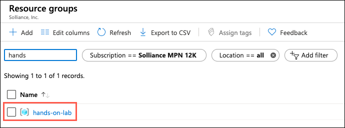

3. In the list of resources within your resource group, select the **LabVM Virtual machine** resource.

   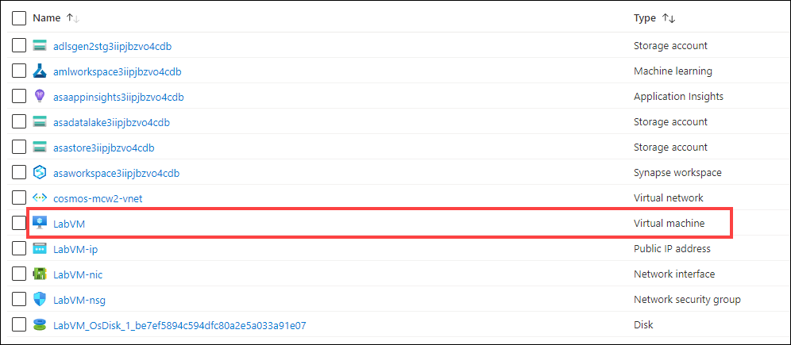

4. On your LabVM blade, select **Connect** and **RDP** from the top menu.

   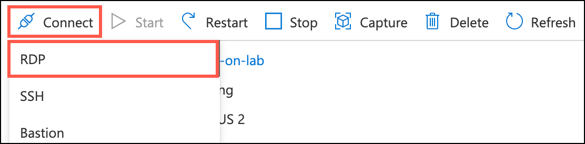

5. On the Connect to virtual machine blade, select **Download RDP File**, then open the downloaded RDP file.

   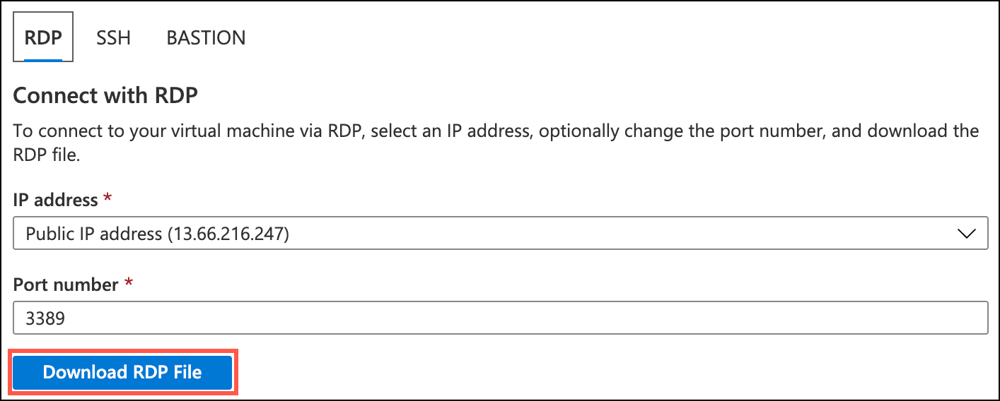

6. Select **Connect** on the Remote Desktop Connection dialog.

   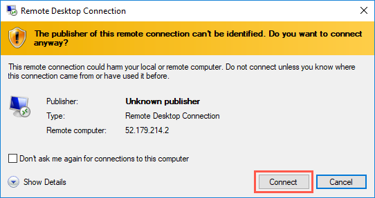

7. Enter the following credentials when prompted, and then select **OK**:

   - **User name**: demouser
   - **Password**: Password.1!!

   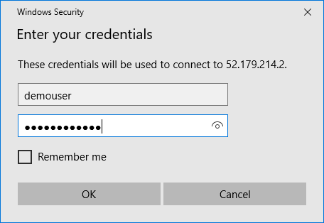

8. Select **Yes** to connect if prompted that the remote computer's identity cannot be verified.

   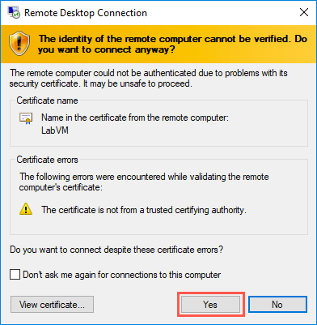

9. Once logged in, select the **Search** icon on the start bar, enter **default apps** into the search box, and select **Default apps** in the search results.

    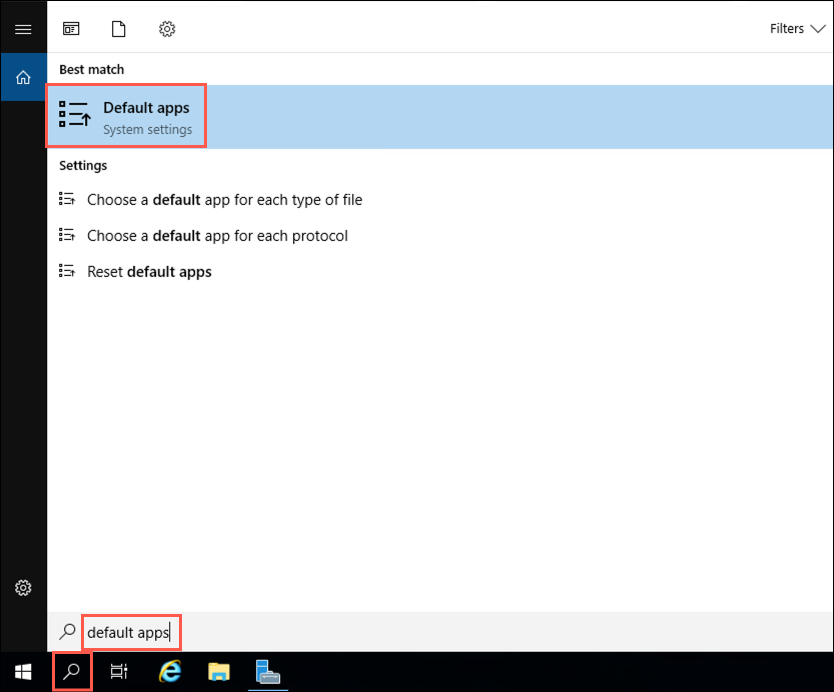

10. In the Default apps dialog, select **Internet Explorer** under **Web browser**.

    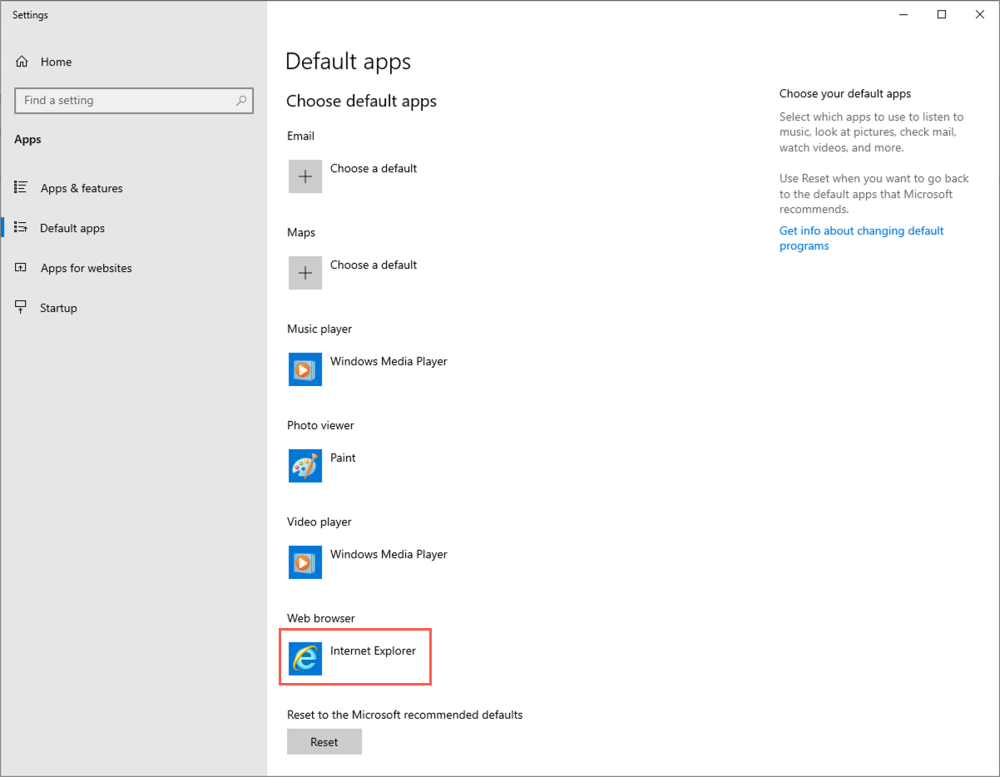

11. In the **Choose an app** dialog, select **Microsoft Edge**.

    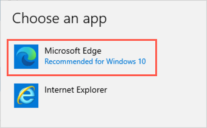

12. Close the **Default apps** dialog.

### Task 4: Download and install Power BI Desktop

Power BI desktop is required to make a connection to your Azure Synapse Analytics environment when creating the Power BI dashboard.

1. Download and install [Power BI Desktop](https://powerbi.microsoft.com/desktop/) on your VM.

You should follow all steps provided _before_ performing the Hands-on lab.
